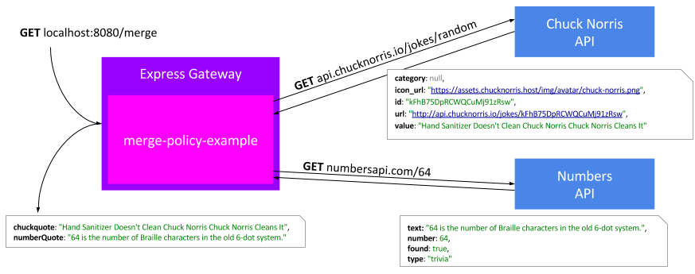
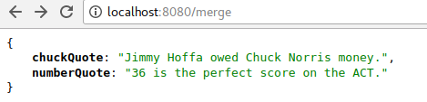

# express-gateway-plugin-merge-example

A simple example of plugin policy for express-gateway.

Note that my intention was just to test the plugin system of express-gateway, nothing more.

# What this policy does

- Call http://api.chucknorris.io/jokes/random using [superagent](https://github.com/visionmedia/superagent)
- Extract the `value` field of the response body to get the quote (warning some of them can be offensive, I am not responsible for this API)
- Call http://numbersapi.com/{number} passing the length of the first quote as the number path param
- Extract the `text` field of the response body
- Return javascript object with the 2 quotes to caller, does not call next(), with following format
`{chuckQuote : quote1, numberQuote: quote2}`



Here is what it looks like



## ES6 and policy code bundling

Code is written in ES6 and bundled using [rollup](https://github.com/rollup/rollup). The config is kind of tricky because of superagent issues. But this is not really the concern of this example !

To bundle (generate) the policy code, simply run

`npm run build`

This will create the following file `dist/merge-example-policy.cjs.js` which is the plugin policy code.

I probably could use webpack as well, but I have never used it :)

## How to execute it inside express-gateway

Here is my gateway.config.yml

```yml
http:
  port: 8080
# https:
#   port: 9999
#   tls: {}
admin: # remove this section to disable admin API
  port: 9876
  hostname: localhost # use 0.0.0.0 to listen on all IPv4 interfaces
apiEndpoints:
  merge:
    host: 'localhost'
    paths: '/merge'
policies:
  - merge-example
pipelines:
  - name: merge
    apiEndpoints:
      - merge
    policies:
        - merge-example :

```

## How I made this work

Thanks to Serhii Kuts

https://groups.google.com/a/express-gateway.io/forum/#!topic/discuss/v0t34Cz-IBU
